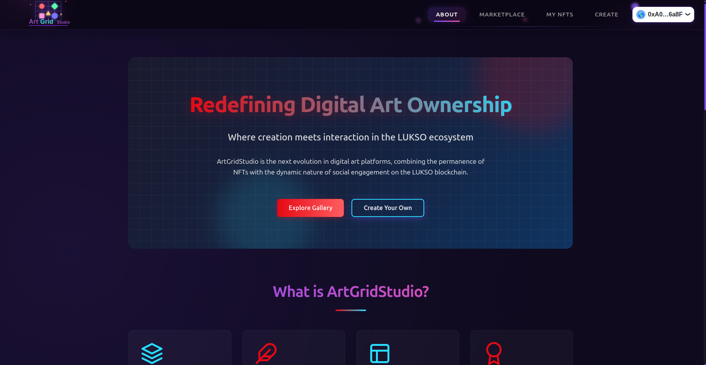
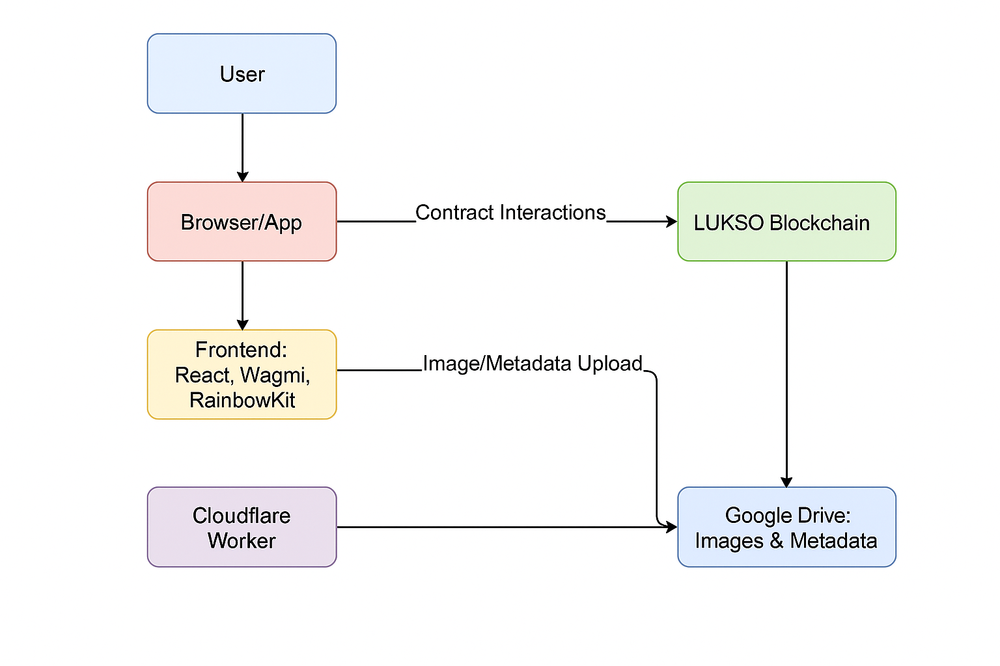

# ArtGrid Studio 🎨

**Welcome to ArtGrid Studio**, an innovative NFT platform that redefines digital art ownership through **multi-tiered NFTs** with engagement-based progression. Built on the **LUKSO blockchain**, our project combines cutting-edge Web3 technology with a user-centric design to empower creators and collectors. Whether you're an artist minting your masterpiece or a collector engaging with exclusive content, ArtGrid Studio is your gateway to the future of digital art. 🚀

- 🔗 **Live App**: [https://art-grid-studio.vercel.app/](https://art-grid-studio.vercel.app/)
- 🎥 **Demo Video**: [https://www.youtube.com/watch?v=Q-7WNl_liGg](https://www.youtube.com/watch?v=Q-7WNl_liGg)
- 💻 **Source Code**: [https://github.com/Anish99594/ArtGridStudio.git](https://github.com/Anish99594/ArtGridStudio.git)

This README provides everything you need to understand, deploy, and contribute to ArtGrid Studio. Let’s create something extraordinary together! 💎

---

## 🌟 Project Overview

ArtGrid Studio is a **decentralized NFT marketplace** that introduces a unique **tiered progression system**. Unlike traditional NFTs, our platform allows NFTs to evolve through **likes**, **comments**, and **LYX staking**, unlocking higher-quality versions and exclusive content as engagement grows. Key features include:

- **Multi-Tiered NFTs**: Each NFT has multiple tiers (Bronze, Silver, Gold) with increasing requirements for likes, comments, and LYX stakes.
- **Engagement-Driven Progression**: Collectors can interact with NFTs to unlock new tiers, enhancing value and exclusivity.
- **Google Drive Integration**: Metadata and images are securely stored on Google Drive, ensuring accessibility and scalability.
- **Intuitive UI/UX**: A sleek React-based frontend with Tailwind CSS, Framer Motion animations, and Wagmi hooks for a seamless experience.
- **LUKSO Blockchain**: Leverages the LUKSO network for low-cost, scalable, and creator-friendly transactions.

---

## 🛠️ Technology Stack

ArtGrid Studio is built with a robust and modern tech stack to ensure scalability, security, and developer-friendliness:

## 🧱 System Architecture

Here's a high-level architecture diagram of **ArtGrid Studio** showing how different components interact across the system:



### Components Overview:
- **Frontend**: Built with React, Tailwind CSS, and Framer Motion. Connects to smart contracts and fetches metadata.
- **Smart Contracts**: Deployed on the LUKSO testnet using Solidity and Hardhat, implementing LSP8 for tiered NFTs.
- **Google Drive + Cloudflare Workers**: Off-chain storage for NFT metadata and media with fast, proxied access.
- **Authentication**: JWT tokens ensure secure API requests from the frontend to backend services.
- **LUKSO Blockchain**: Handles minting, engagement tracking, and staking with low-cost and scalable transactions.

### Backend (Smart Contracts)
- **Solidity**: Smart contracts written in Solidity (^0.8.15) for secure and reliable NFT functionality.
- **LUKSO LSP Standards**: Utilizes LSP8IdentifiableDigitalAsset for advanced NFT features.
- **OpenZeppelin**: Incorporates battle-tested contracts for security (`ReentrancyGuard`, `Pausable`).
- **Hardhat**: Development environment for compiling, testing, and deploying contracts.

### Frontend
- **React**: A fast and modular frontend built with React for dynamic UI components.
- **Wagmi**: Web3 hooks for seamless blockchain interactions (e.g., `useReadContract`, `useWriteContract`).
- **RainbowKit**: Wallet connection library for a smooth user onboarding experience.
- **Tailwind CSS**: Utility-first CSS framework for responsive and modern styling.
- **Framer Motion**: Animations for engaging transitions and micro-interactions.
- **P-Queue**: Manages concurrent metadata fetching to optimize performance.
- **Jose**: JWT generation for secure API authentication.

### Infrastructure
- **Google Drive API**: Stores NFT metadata and images securely with shareable links.
- **Cloudflare Workers**: Proxy service for fetching and caching Google Drive content.
- **Vite**: Lightning-fast build tool for the frontend.
- **Pyodide**: (Optional) For potential future integrations with Python-based analytics.

### Development Tools
- **ESLint & Prettier**: Ensures code quality and consistency.
- **Vercel**: (Optional) For easy frontend deployment.
- **GitHub Actions**: CI/CD pipeline for automated testing and deployment.

---

## 🚀 Getting Started

Follow these steps to set up ArtGrid Studio locally and start exploring the platform.

### Prerequisites
- **Node.js**: v16 or higher
- **npm** or **yarn**: Package manager for frontend dependencies
- **Hardhat**: For smart contract development
- **MetaMask**: Wallet for interacting with the LUKSO testnet
- **LUKSO Testnet LYX**: Faucet available at [LUKSO Testnet Faucet](https://faucet.lukso.network/)
- **Google Drive API Credentials**: For metadata and image storage
- **Cloudflare Workers Account**: For proxying Google Drive content

### Installation

1. **Clone the Repository**:
   ```
   git clone https://github.com/your-username/artgrid-studio.git
   cd artgrid-studio
   ```

2. **Install Backend Dependencies**:
   ```
   cd my-backend
   npm install
   ```

3. **Install Frontend Dependencies**:
   ```
   cd ../frontend
   npm install
   ```

4. **Configure Environment Variables**:
   - Create a `.env` file in the `contracts` directory:
     ```
     PRIVATE_KEY=your_wallet_private_key
     LUKSO_RPC_URL=https://rpc.testnet.lukso.network
     ```
   - Create a `.env` file in the `frontend` directory:
     ```
     VITE_SERVER_URL=https://your-cloudflare-worker.workers.dev
     VITE_SHARED_SECRET=your_jwt_secret
     ```

5. **Compile and Deploy Smart Contracts**:
   ```
   cd contracts
   npx hardhat compile
   npx hardhat run scripts/deploy.js --network luksoTestnet
   ```
   - Update `ARTGRIDSTUDIO_ADDRESS` in `frontend/src/App.jsx` and `frontend/src/components/NFTCard.jsx` with the deployed contract address.

6. **Run the Frontend**:
   ```
   cd ../frontend
   npm run dev
   ```
   - Open `http://localhost:5173` in your browser.

### Testing
- **Smart Contracts**:
   ```
   cd contracts
   npx hardhat test
   ```
- **Frontend**:
   ```
   cd frontend
   npm run test
   ```

### Deployment
- **Smart Contracts**: Deploy to LUKSO mainnet using Hardhat (update `hardhat.config.js` with mainnet RPC).
- **Frontend**: Deploy to Vercel or Netlify for a production-ready app.
- **Cloudflare Workers**: Deploy the proxy service using `wrangler deploy`.

---

## 📖 Usage

### For Creators
1. **Connect Wallet**: Use MetaMask to connect to the LUKSO testnet.
2. **Create NFT**:
   - Navigate to the "Create" tab.
   - Enter NFT details (name, description, price).
   - Configure three tiers (Bronze, Silver, Gold) with engagement requirements and unique images.
   - Mint the NFT to the blockchain.
3. **List for Sale**: After minting, list your NFT on the marketplace.

### For Collectors
1. **Browse Marketplace**: Explore available NFTs in the "Marketplace" tab.
2. **Engage with NFTs**:
   - **Like**: Add a like to increase engagement (one like per user).
   - **Comment**: Share thoughts to contribute to tier progression.
   - **Stake LYX**: Stake LYX to unlock higher tiers.
3. **Purchase NFTs**: Buy NFTs directly from the marketplace using LYX.
4. **View Owned NFTs**: Check your collection in the "My NFTs" tab.

### Key Interactions
- **Tier Progression**: NFTs unlock new tiers when engagement thresholds (likes, comments, LYX stakes) are met.
- **Dynamic Metadata**: Metadata updates automatically as tiers are unlocked, fetched from Google Drive.
- **Responsive UI**: Animations and a clean design enhance the user experience.

---

## 🌈 Key Features

ArtGrid Studio stands out with its innovative and user-focused features:

1. **Engagement-Based NFTs**: Community interaction drives NFT value through a tiered progression system.
2. **LUKSO Integration**: Leverages LUKSO’s creator-friendly blockchain for low fees and scalability.
3. **Seamless UX**: Framer Motion animations, toast notifications, and a responsive design create a delightful experience.
4. **Robust Error Handling**: Comprehensive error boundaries and retry logic ensure reliability.
5. **Scalable Storage**: Google Drive integration reduces on-chain costs while maintaining accessibility.
6. **Secure Authentication**: JWT-based API calls protect metadata and image fetching.
7. **Performance Optimization**: P-Queue for concurrent requests, image caching, and debounced interactions.

---

## 🐛 Known Issues & Future Enhancements

### Known Issues
- **Google Drive Rate Limits**: API calls may hit rate limits under heavy load. Mitigated with caching and retries.
- **Image Loading**: Occasional delays in fetching Google Drive images. Handled with fallback images and retry logic.
- **Gas Optimization**: Some contract functions could be further optimized for lower gas costs.

### Future Enhancements
- **Analytics Dashboard**: Add a stats page with NFT performance metrics using Matplotlib (via Pyodide).
- **Social Sharing**: Enable sharing NFT links on platforms like X.
- **Advanced Filtering**: Enhance marketplace search with category tags and advanced sorting.
- **Mobile App**: Develop a native app using React Native for broader accessibility.
- **Multi-Chain Support**: Extend to other EVM-compatible chains like Ethereum or Polygon.

---

## 🤝 Contributing

We welcome contributions to make ArtGrid Studio even better! Here’s how to get involved:

1. **Fork the Repository**:
   ```
   git clone https://github.com/your-username/artgrid-studio.git
   ```

2. **Create a Branch**:
   ```
   git checkout -b feature/your-feature
   ```

3. **Make Changes**: Follow the coding style (ESLint/Prettier) and add tests.
4. **Submit a Pull Request**: Include a clear description of your changes.

**Contribution Ideas**:
- Improve smart contract gas efficiency.
- Add new UI animations or components.
- Enhance error handling for edge cases.
- Write additional tests for frontend and backend.

---

## 📜 License

This project is licensed under the **Apache-2.0 License**. See the [LICENSE](LICENSE) file for details.

---

## 🙌 Acknowledgments

- **LUKSO Team**: For creating a creator-centric blockchain.
- **OpenZeppelin**: For secure and reliable contract libraries.
- **Wagmi & RainbowKit**: For simplifying Web3 development.
- **Google Drive API**: For scalable storage solutions.

---

## 📬 Contact

Have questions or want to collaborate? Reach out to us:

- **Email**: anishgajbhare2000@gmail.com
- **Twitter**: [@ArtGridStudio](https://twitter.com/ArtGridStudio)
- **Discord**: Join our [community server](https://discord.gg/artgridstudio)
- **GitHub Issues**: Report bugs or suggest features [here](https://github.com/your-username/artgrid-studio/issues)

---

**ArtGrid Studio** is more than an NFT platform—it’s a movement to empower creators and collectors through engagement and innovation. Join us in shaping the future of digital art! 🌟
